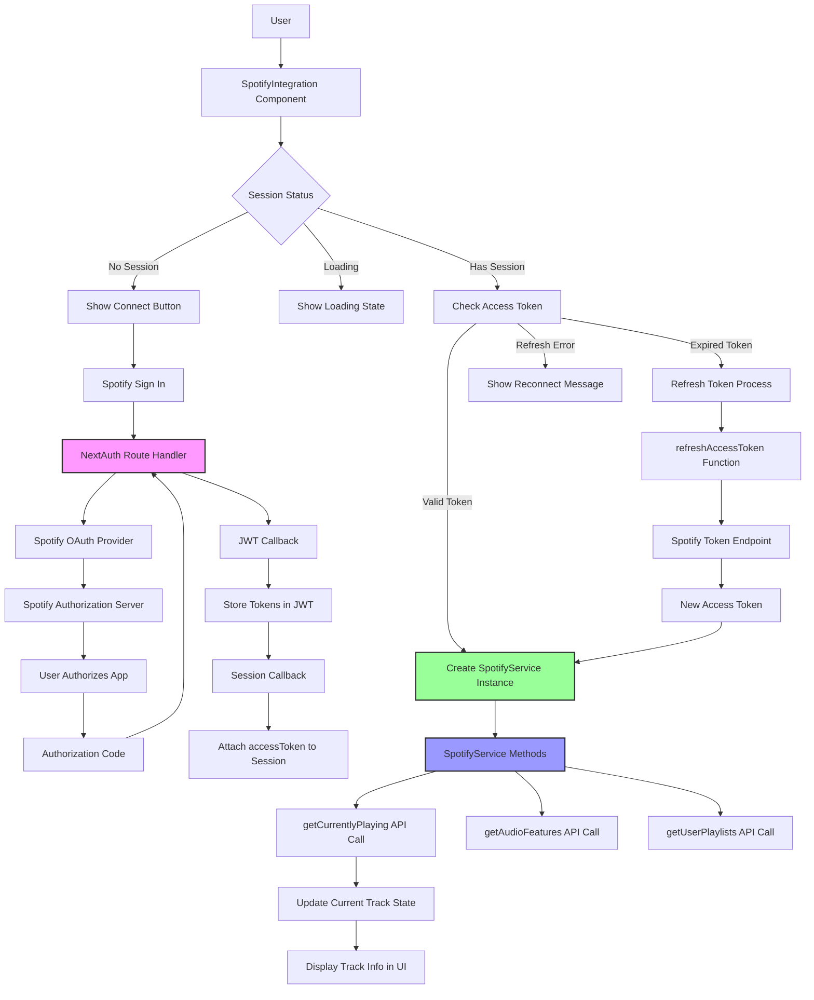

# SpotifyService and NextJS Auth Integration Diagram



## Key Components

1. **NextAuth Route Handler** (`/api/auth/[...nextauth]/route.ts`): Manages OAuth flow with Spotify
2. **SpotifyService Class** (`/services/spotify.ts`): Handles Spotify API calls with access token
3. **SpotifyIntegration Component** (`/components/SpotifyIntegration.tsx`): UI component managing auth state and displaying track info
4. **Type Extensions** (`/types/next-auth.d.ts`): Extends NextAuth types to include Spotify tokens

## Flow

- User clicks "Connect Spotify" → NextAuth handles OAuth → Tokens stored in JWT → Session provides access token → SpotifyService makes API calls → Track data displayed in UI
- Token refresh happens automatically when expired via `refreshAccessToken` function

## File Structure

```
src/
├── app/
│   └── api/
│       └── auth/
│           └── [...nextauth]/
│               └── route.ts          # NextAuth configuration and handlers
├── components/
│   └── SpotifyIntegration.tsx        # UI component for Spotify integration
├── services/
│   └── spotify.ts                    # SpotifyService class for API calls
└── types/
    └── next-auth.d.ts               # Type extensions for NextAuth
```